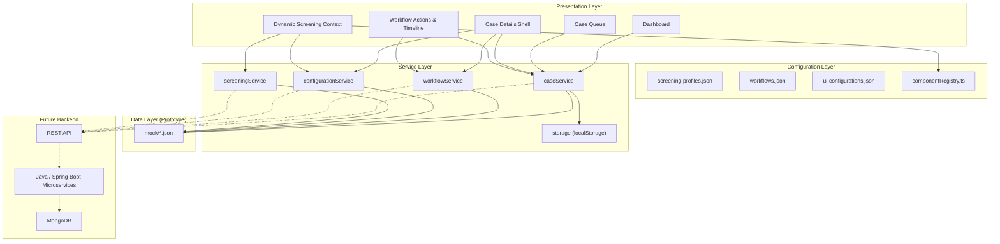
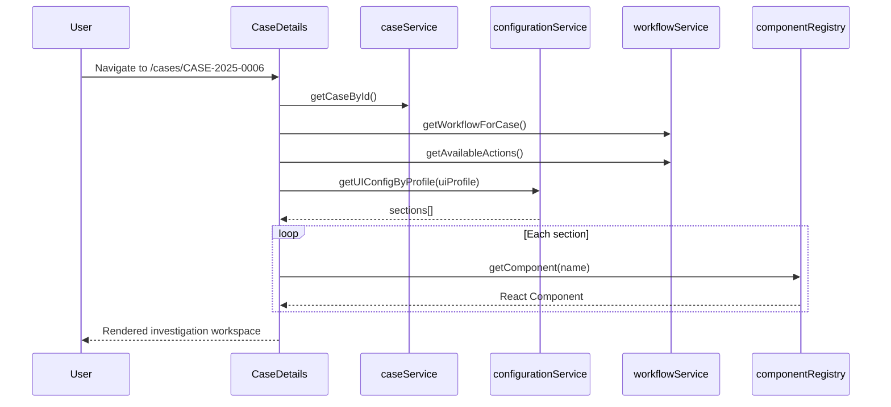
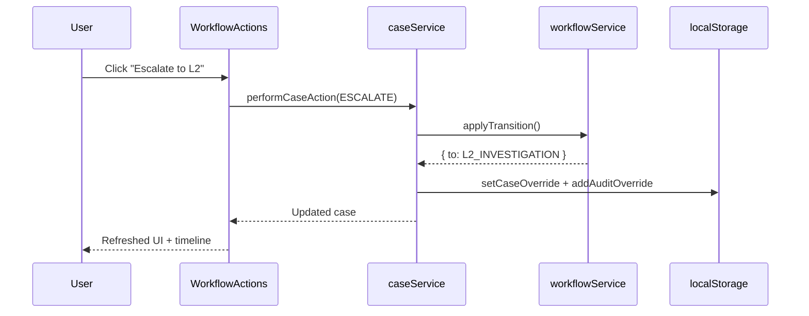

# Case Management Platform — Architecture

This document describes the architectural design of the configurable Case Management Platform prototype. It explains how a **single application shell** supports multiple screening types through configuration rather than hardcoded, type-specific pages.

For setup and demo scenarios, see [README.md](./README.md).

---

## 1. Design Principles

| Principle | Description |
|-----------|-------------|
| **One platform, many screening types** | Customer, Transaction, and Security screening share the same case lifecycle, queue, and details shell. |
| **Configuration over code** | Workflows, UI layouts, and screening profiles are defined in JSON — not embedded in React pages. |
| **Component registry** | Screening-specific UI is composed from reusable, registered components selected at runtime. |
| **Service abstraction** | React components never import mock JSON directly; all data access goes through services. |
| **Backend-ready** | The service layer can be swapped from local JSON to REST APIs without UI changes. |

---

## 2. High-Level Architecture



---

## 3. Core Concept

The platform is built around three cooperating ideas:

```text
Common Case Management Shell
        +
Screening-Specific Dynamic UI
        +
Configurable Workflow
```

### 3.1 Common Case Management Shell

Every case — regardless of screening type — uses the same `CaseDetails` page structure:

```text
Case Header
    ↓
Workflow Timeline
    ↓
Case Summary
    ↓
Dynamic Screening Context   ← changes per screening type / UI profile
    ↓
Evidence
    ↓
Comments
    ↓
Audit Timeline
    ↓
Workflow Actions
```

Implementation: `src/pages/CaseDetails/CaseDetails.tsx`

### 3.2 Screening-Specific Dynamic UI

The **Dynamic Screening Context** section is not hardcoded. It is rendered from `ui-configurations.json` via the component registry.

```text
uiProfile (on case record)
    → ui-configurations.json (sections + component names)
    → componentRegistry.ts (React component lookup)
    → Rendered section panels
```

Implementation: `src/components/case/DynamicScreeningContext.tsx`

### 3.3 Configurable Workflow

Case progression (L1 → L2 → L3, resolve, on hold, reopen) is driven by `workflows.json`. The UI discovers available actions from the current case status and workflow transitions — nothing is hardcoded as `L1 → L2 → L3`.

Implementation: `src/services/workflowService.ts`, `src/components/workflow/`

---

## 4. Layered Architecture

### 4.1 Presentation Layer

| Module | Path | Responsibility |
|--------|------|----------------|
| Dashboard | `pages/Dashboard/` | Aggregated KPIs, breakdowns, recent cases |
| Case Queue | `pages/CaseQueue/` | Search, filter, sort, paginate cases |
| Case Details | `pages/CaseDetails/` | Investigation workspace shell |
| Common UI | `components/common/` | Cards, badges, modals, layout |
| Customer UI | `components/customer/` | Customer profile, related parties |
| Transaction UI | `components/transaction/` | Message, transaction details, related info |
| Security UI | `components/security/` | Security event, subject, threat info |
| Investigation | `components/investigation/` | Notes, evidence, comments, timeline |
| Workflow | `components/workflow/` | Actions, progress timeline |

### 4.2 Service Layer

Components call services only — never mock JSON files.

| Service | File | Responsibility |
|---------|------|----------------|
| `caseService` | `services/caseService.ts` | Cases CRUD, queue, dashboard stats, actions, audit |
| `workflowService` | `services/workflowService.ts` | Workflow lookup, transitions, available actions |
| `configurationService` | `services/configurationService.ts` | UI profiles, screening profiles |
| `screeningService` | `services/screeningService.ts` | Domain entities (customers, transactions, events, users) |
| `storage` | `services/storage.ts` | localStorage merge for prototype persistence |

**Data flow (current prototype):**

```text
React Component
       ↓
   caseService
       ↓
  mock/cases.json  +  localStorage overrides
```

**Data flow (target production):**

```text
React Component
       ↓
   caseService
       ↓
    REST API
       ↓
 Java Microservice
       ↓
    MongoDB
```

The React layer should not need to change when the backend is introduced — only service implementations change.

### 4.3 Configuration Layer

| Config File | Purpose |
|-------------|---------|
| `screening-profiles.json` | Maps screening type → workflow + UI profile |
| `workflows.json` | States, transitions, initial level, actions |
| `ui-configurations.json` | Section layout per UI profile |
| `componentRegistry.ts` | Maps component name strings → React components |

### 4.4 Data Layer (Prototype)

| File | Contents |
|------|----------|
| `cases.json` | 15 case records across all screening types |
| `customers.json` | Customer screening domain data |
| `transactions.json` | Transaction screening domain data |
| `security-events.json` | Security screening domain data |
| `users.json` | Investigators for assignment |
| `workflows.json` | Workflow definitions |
| `ui-configurations.json` | UI section layouts |
| `screening-profiles.json` | Screening type registry |
| `audit-events.json` | Case timeline / audit trail |

---

## 5. Component Registry

The registry decouples **configuration** (JSON component names) from **implementation** (React components).

```typescript
// src/config/componentRegistry.ts
componentRegistry = {
  CustomerProfile,
  BeneficiaryDetails,
  TransactionMessage,
  TransactionDetails,
  ScreeningResults,
  RelatedCases,
  SecurityEvent,
  SecuritySubject,
  ThreatRiskInfo,
  InvestigationNotes,
  Timeline,
}
```

At runtime, `DynamicScreeningContext` resolves each section:

```text
section.component = "TransactionMessage"
    → getComponent("TransactionMessage")
    → <TransactionMessage caseId={...} referenceId={...} />
```

### Adding a new UI section

1. Build the React component under `components/`.
2. Register it in `componentRegistry.ts`.
3. Add a section entry to the relevant profile in `ui-configurations.json`.

No changes to `CaseDetails.tsx` are required.

---

## 6. Dynamic UI Configuration

Example UI profile (`transaction-investigation`):

```json
{
  "uiProfile": "transaction-investigation",
  "screeningType": "TRANSACTION_SCREENING",
  "sections": [
    { "id": "transaction-message", "component": "TransactionMessage", "title": "Transaction Message", "order": 1 },
    { "id": "transaction-details", "component": "TransactionDetails", "title": "Transaction Details", "order": 2 },
    { "id": "screening-results", "component": "ScreeningResults", "title": "Screening Results", "order": 3 },
    { "id": "related-info", "component": "RelatedCases", "title": "Related Information", "order": 4 },
    { "id": "investigation", "component": "InvestigationNotes", "title": "Investigation", "order": 5 }
  ]
}
```

Each case carries a `uiProfile` field that selects which configuration to render.

| Screening Type | UI Profile | Key Sections |
|----------------|------------|--------------|
| `CUSTOMER_SCREENING` | `customer-investigation` | Customer Details, Related Parties, Screening Results |
| `TRANSACTION_SCREENING` | `transaction-investigation` | Transaction Message, Transaction Details, Related Info |
| `SECURITY_SCREENING` | `security-investigation` | Security Event, Subject, Threat / Risk Info |

---

## 7. Workflow Engine

Workflows are state machines defined in JSON.

```json
{
  "workflowId": "transaction-standard",
  "screeningType": "TRANSACTION_SCREENING",
  "initialLevel": "L1",
  "initialStatus": "L1_INVESTIGATION",
  "states": ["NEW", "L1_INVESTIGATION", "L2_INVESTIGATION", "L3_INVESTIGATION", "ON_HOLD", "RESOLVED", "CLOSED"],
  "transitions": [
    { "from": "L1_INVESTIGATION", "to": "L2_INVESTIGATION", "action": "ESCALATE", "label": "Escalate to L2" },
    { "from": "L1_INVESTIGATION", "to": "RESOLVED", "action": "RESOLVE", "label": "Resolve", "requiresDecision": true }
  ]
}
```

### Workflow resolution

```text
case.workflowId
    → workflows.json
    → filter transitions where transition.from === case.status
    → render WorkflowActions buttons
```

### Case actions

| Action | Effect |
|--------|--------|
| `ASSIGN` | Assign investigator; start investigation if status is NEW |
| `ESCALATE` | Move to next configured level (L1 → L2 → L3) |
| `RESOLVE` | Close with decision + reason |
| `ON_HOLD` | Pause with reason |
| `REOPEN` | Return resolved case to investigation |
| `CLOSE` | Final close from resolved state |

Each action creates an audit event and persists changes via `localStorage` in the prototype.

---

## 8. Configurable Routing (Direct L2 Entry)

Standard transaction workflow starts at **L1**:

```json
{ "workflowId": "transaction-standard", "initialLevel": "L1", "initialStatus": "L1_INVESTIGATION" }
```

High-risk transaction workflow enters directly at **L2**:

```json
{ "workflowId": "high-risk-transaction", "initialLevel": "L2", "initialStatus": "L2_INVESTIGATION" }
```

Case `CASE-2025-0009` uses `high-risk-transaction`. The workflow timeline visually marks L1 as **skipped** and shows the case entered at L2.

This demonstrates that routing is configuration — not a fixed `L1 → L2 → L3` path in code.

Implementation: `src/components/workflow/WorkflowTimeline.tsx`, `getInitialRouteInfo()` in `workflowService.ts`

---

## 9. Screening Profiles

Screening profiles bind a screening type to its workflow and UI layout:

```json
{
  "id": "transaction-screening",
  "name": "Transaction Screening",
  "type": "TRANSACTION_SCREENING",
  "workflow": "transaction-standard",
  "uiProfile": "transaction-investigation",
  "enabled": true
}
```

```text
Screening Profile
    ├── type          (CUSTOMER | TRANSACTION | SECURITY)
    ├── workflow      → workflows.json
    └── uiProfile     → ui-configurations.json
```

Adding a new screening type in the future:

1. Add profile to `screening-profiles.json`
2. Add workflow to `workflows.json`
3. Add UI config to `ui-configurations.json`
4. Register any new components
5. Add domain mock data (or microservice)

The platform shell remains unchanged.

---

## 10. Case Lifecycle & Audit Trail

Every significant action produces an audit event:

```text
Case Created
    ↓
Assigned to Investigator
    ↓
Investigation Started
    ↓
Evidence Added / Comment Added
    ↓
Escalated (L1 → L2)
    ↓
Case Resolved / Reopened
```

Audit events are stored in `audit-events.json` and appended at runtime to `localStorage`. The timeline component merges both sources and renders chronologically.

Implementation: `src/components/investigation/Timeline.tsx`, `caseService.performCaseAction()`

---

## 11. Folder Structure

```text
src/
├── components/
│   ├── common/           AppLayout, Card, Badge, Modal, form controls
│   ├── case/             DynamicScreeningContext
│   ├── customer/         CustomerProfile, BeneficiaryDetails
│   ├── transaction/      TransactionMessage, TransactionDetails, RelatedCases
│   ├── security/         SecurityEvent, SecuritySubject, ThreatRiskInfo
│   ├── investigation/    Notes, Evidence, Comments, Timeline, ScreeningResults
│   └── workflow/         WorkflowActions, WorkflowTimeline
│
├── pages/
│   ├── Dashboard/        Operations overview
│   ├── CaseQueue/        Searchable case list
│   └── CaseDetails/      Investigation workspace
│
├── services/
│   ├── caseService.ts
│   ├── workflowService.ts
│   ├── configurationService.ts
│   ├── screeningService.ts
│   └── storage.ts
│
├── config/
│   └── componentRegistry.ts
│
├── mock/
│   ├── cases.json
│   ├── customers.json
│   ├── transactions.json
│   ├── security-events.json
│   ├── users.json
│   ├── workflows.json
│   ├── ui-configurations.json
│   ├── screening-profiles.json
│   └── audit-events.json
│
├── types/
│   ├── case.ts
│   ├── workflow.ts
│   ├── screening.ts
│   └── ui-config.ts
│
└── App.tsx               React Router setup
```

---

## 12. Type Model

Key TypeScript types enforce consistency across layers:

| Type | File | Purpose |
|------|------|---------|
| `CaseRecord` | `types/case.ts` | Core case entity |
| `CaseStatus`, `CaseLevel`, `CasePriority` | `types/case.ts` | Case state enums |
| `WorkflowConfig`, `WorkflowTransition` | `types/workflow.ts` | Workflow state machine |
| `UIConfiguration`, `UISectionConfig` | `types/ui-config.ts` | Dynamic UI layout |
| `ScreeningProfile` | `types/screening.ts` | Screening type registry entry |
| `CustomerRecord`, `TransactionRecord`, `SecurityEventRecord` | `types/screening.ts` | Domain entities |
| `AuditEvent` | `types/screening.ts` | Timeline / audit trail |

---

## 13. Request Flow Examples

### Opening a case



### Escalating a case



---

## 14. Prototype vs Production

| Concern | Prototype (current) | Production (target) |
|---------|---------------------|---------------------|
| Case data | `mock/cases.json` + localStorage | Case Management microservice + MongoDB |
| Domain data | `mock/customers.json`, etc. | Screening microservices |
| Workflows | Static JSON files | Workflow configuration service / admin API |
| UI config | Static JSON files | Configuration service with versioning |
| Auth | Hardcoded current user | Identity / SSO integration |
| Persistence | Browser localStorage | Server-side state + optimistic UI |
| Audit | JSON + localStorage append | Immutable audit log service |

---

## 15. Extension Points

The architecture supports these extensions without rebuilding the platform:

1. **New screening type** — Add profile, workflow, UI config, and domain components.
2. **New workflow path** — Add workflow JSON with custom initial level or transitions.
3. **New UI section** — Register component + add section to UI config.
4. **New case action** — Add transition + handler in `caseService.performCaseAction()`.
5. **Backend integration** — Replace service internals with `fetch`/HTTP client calls.
6. **Admin console** — CRUD for workflows, profiles, and UI configs via API.

---

## 16. Related Documentation

- [README.md](./README.md) — Setup, demo scenarios, quick start
- `src/mock/` — Reference data and configuration examples
- `src/types/` — TypeScript contracts shared across layers
